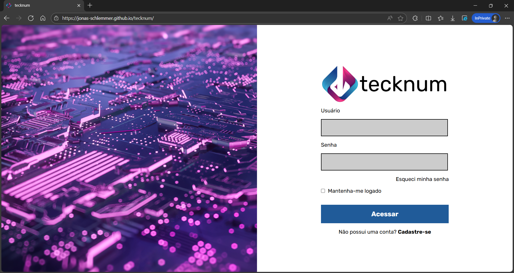
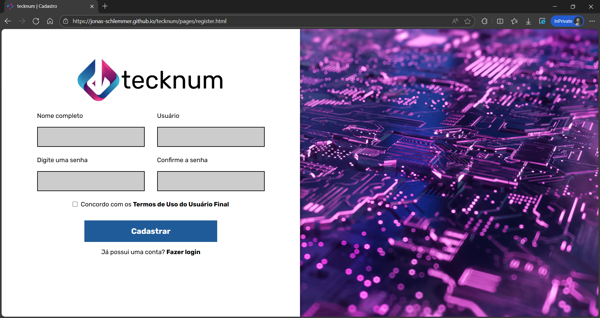
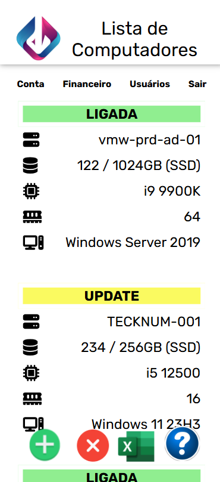

# 📝 tecknum
Projeto final da disciplina Desenvolvimento de Sistemas Web I na QI Escolas.
Interface estática desenvolvida para gerenciar máquinas virtuais.

## 🛠️ Tecnologias
- HTML5;
- CSS3;
- UX/UI Design.

## ✅ Funcionalidades
- Telas de login e de cadastro de usuários;
- Listagem de computadores cadastrados;
- Mobile First Design.

## 🖼️ Telas

## 🚀 Como Executar
#### Acesso web:
https://jonas-schlemmer.github.io/tecknum/

## 👤 Autores
- [Jonas Schlemmer](https://github.com/jonas-schlemmer)